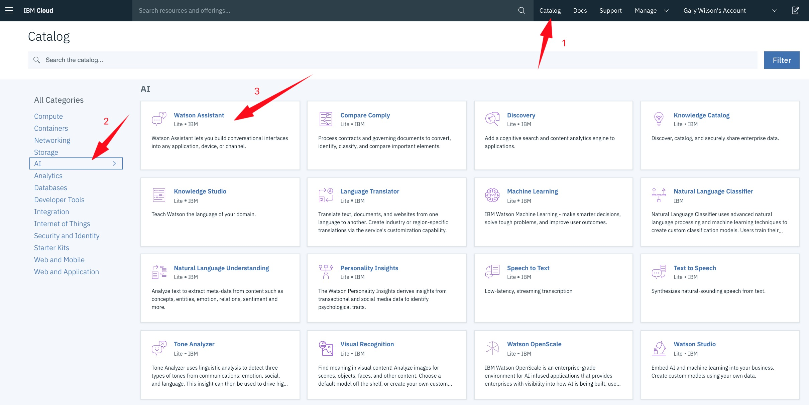
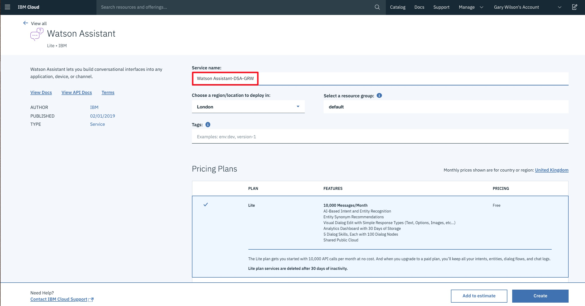
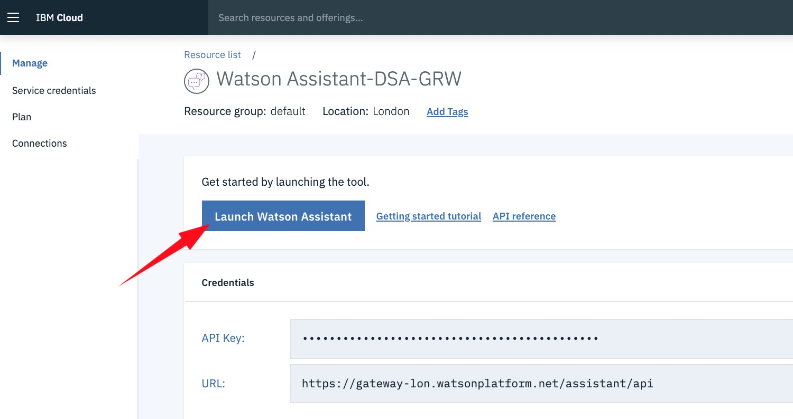
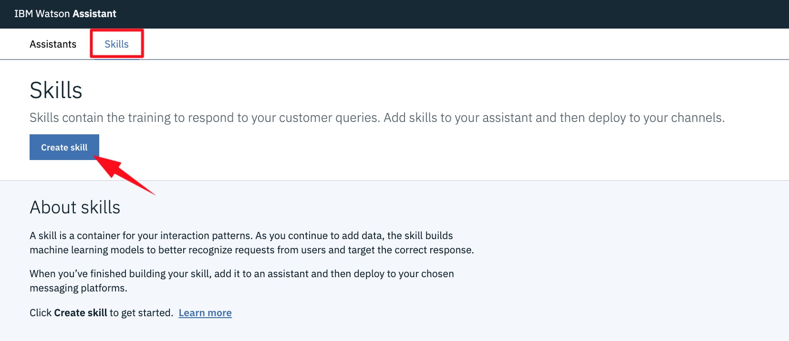
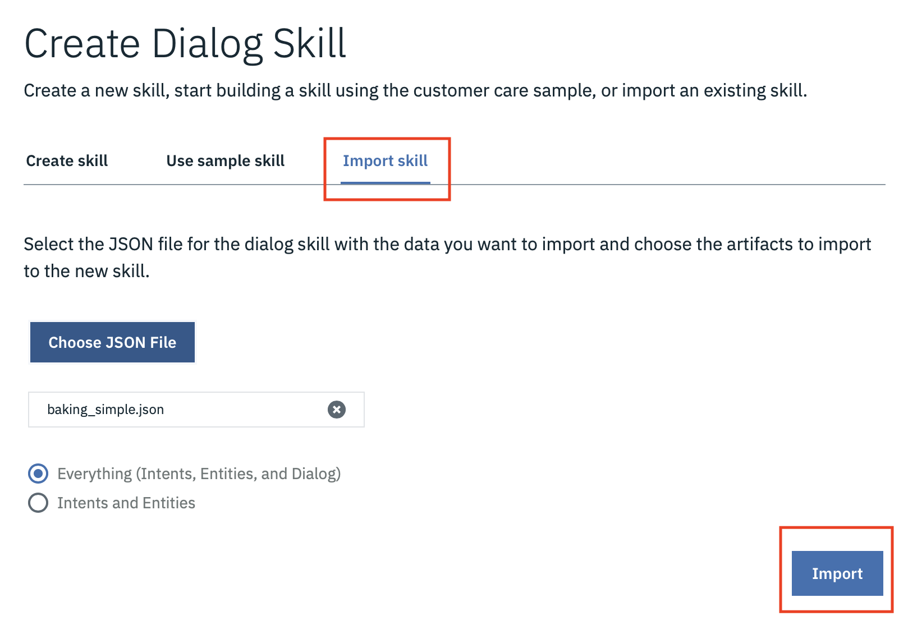
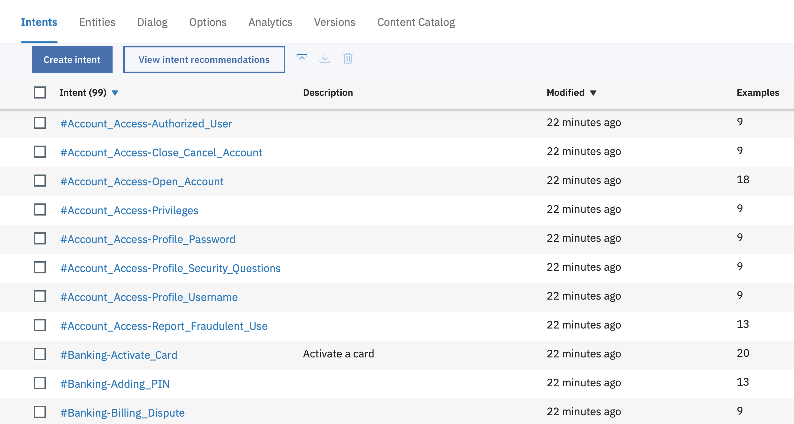
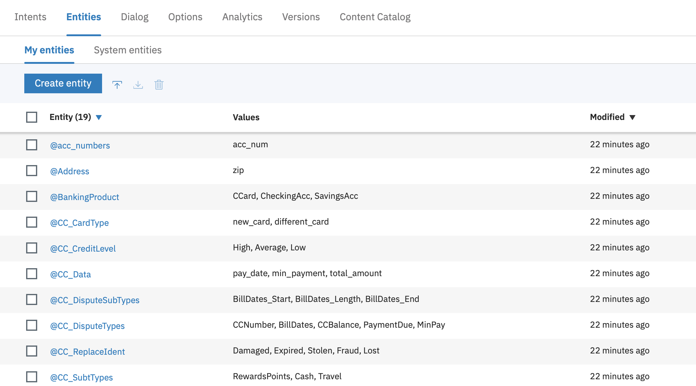
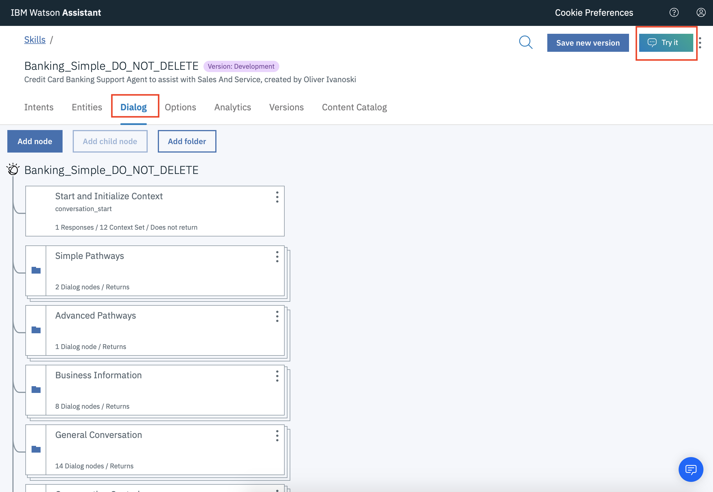
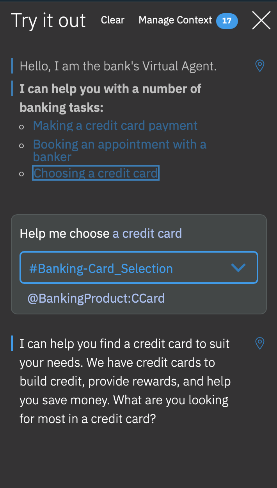

# _**Watson Assistant Lab 1**_: Cognitive Chatbot Basics
In this lab we'll start to build a chatbot using _**Watson Assistant**_. This basic chatbot is a banking bot that will help the user with things like making a credit card payment or choosing a credit card. 

## Requirements
- [IBM Cloud account](https://cloud.ibm.com/)

## Agenda
- Introduction to [Watson Assistant](https://www.ibm.com/cloud/watson-assistant/)
- Setup the **_Watson Assistant_** service
- Understanding user intent: create **_intents_** and _**entities**_
- Building chatbot responses: create a _**dialog tree**_
- Test your chatbot
- Adding rich content: sending images

## Introduction to Watson Assistant
IBM **_Watson Assistant_** allows you to create cognitive chatbots that you can customise for your business, and deploy them across multiple channels to bring help to your customers where and when they need it.

Most chatbots try to mimic human interactions, which can frustrate users when a misunderstanding arises. Watson Assistant is more. It knows when to search for an answer from a knowledge base, when to ask for clarity, and when to direct you to a human.

Anyone can build chatbots with **_Watson Assistant_** - it comes pre-trained with industry-relevant content, can make sense of your historical chat or call logs, and has a visual dialog editor. Industry-leading AI powers the underlying natural language models that understand your users and provides training recommendations as you build and run your chatbot. And you have the flexibility to deploy **_Watson Assistant_** within your own site, in a mobile app, and via many messaging channels and customer service tools.

## Setup the Watson Assistant service
In this section we are going to create a **_Watson Assistant_** instance on IBM Cloud, and use it to build a basic chatbot that answers queries about mobile phones.

**(1)** Log into IBM Cloud and create a **_Watson Assistant_** service.
- Click on `Catalog`, then filter by clicking on `AI`
- Select `Watson Assistant`

  

**(2)** Create the service with a unique name: we'd suggest something like `Watson Assistant-eventname-yourinitials`.

Scroll down and ensure you are using the `Lite` plan, then hit `Create`.

**(3)** Click on `Launch Watson Assistant`.

## Understanding user intent: create _**intents**_ and _**entities**_
**(1)** The first thing we need to do in **_Watson Assistant_** is create a _**Skill**_. A _**skill**_ contains the training data and machine learning logic that enables your chatbot to understand and help users and customers.

Due to time contrains in this session we will import an existing skill. Download the skill from this link: https://ibm.box.com/v/bank-skill-wa

There's an `Import Skill` option available whenever you create a new skill - it will be useful when you are backing up, exchanging skills, etc. Find the downloaded .json file in your computer and choose to import Everything.

You will be directed to the chatbot content. 

**(2)** Explore the chatbot dialog _**Dialog**_.

An _**intent**_ represents the purpose of a user's input. By recognising the intent expressed by a user, Watson Assistant can choose the correct dialog flow to use to respond to it. To plan the intents for your application, you need to consider what your chatbot users might want to do, and what you want your application to be able to handle.

An _**entity**_ represents a term or object in the user's input that provides **context** for a particular _intent_. If _intents_ represent _verbs_ (something a user wants to do), _entities_ represent _nouns_ (such as the object of, or the context for, an action).

_**Watson Assistant**_ can also recommend _**synonyms**_ for your _**entity**_ values. The recommender finds related _synonyms_ based on contextual similarity extracted from a vast body of existing information, and uses natural language processing techniques to identify words similar to the existing _synonyms_ in your _entity_ value.

You can also use _**pattern matching**_ when creating _entity_ values. This is really helpful if you want to pick up _entities_ that have specific formats, e.g. phone numbers or website addresses.

A _**dialog**_ uses the _intents_ and _entities_ that are identified in the user's input, plus _context_ from the application that uses _**Watson Assistant**_, to interact with the user and ultimately provide a useful response. Our _dialog_ tree should help the user choose a new mobile phone based on an existing preference or a characteristic important to the user.

## Test your chatbot
**(1)** You can test your _dialog_ inside the _**Watson Assistant**_ application. Select the `Try It` button at the top right of the screen to enter the _dialog_ tester:

**(2)** Try and test all of your _dialog_ branches. It'll look something like this:

See how _**Watson Assistant**_ is picking out the _intents_ and _entities_ it sees in the user input, and responds accordingly.

## UI

## Summary
Well done! You've created your first basic chatbot that understands user _intent_, can pick out _entities_, and responds differently depending on user input. The next lab will show you how to actually get your chatbot in front of your users, using multiple _**integration**_ points.

Now go to [Lab 2: Chatbot Integrations](../2-Integrations) to get your chatbot working in a live environment.
