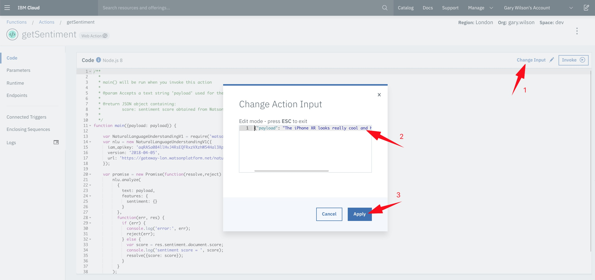
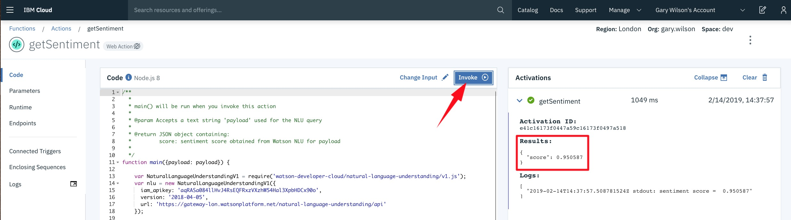
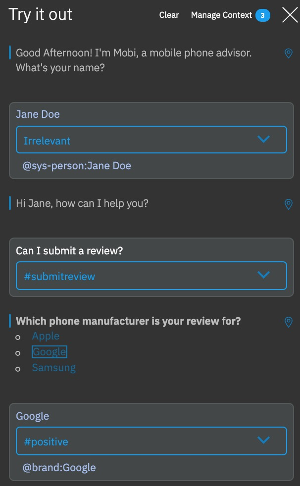
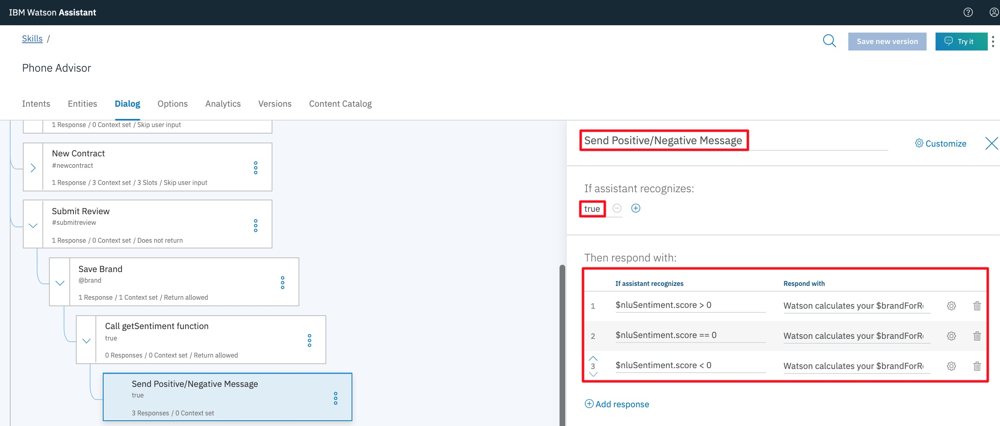
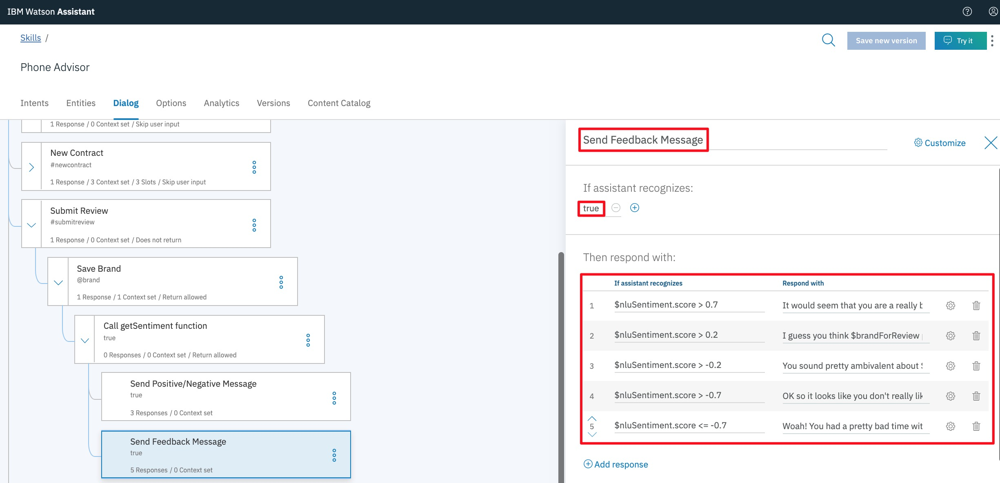

# _**Watson Assistant Lab 2**_: Integrations - Integrating RPA with Watson Assistant
In this lab we're going to show how you can extend your chatbot by using RPA capabilities using _**IBM Cloud Functions**_.

In practical terms, we'll build another _**Watson Assistant**_ _intent_, that allows the user to submit a new address information. When we pick up this _intent_, we'll ask the user for the new address, feed the input text through the RPA and return a response based on the success of the address change. 

## Requirements
- IBM Cloud account 
- Previous lab

## Agenda
- Setup _**IBM Cloud Function**_
- Setup _**Watson Assistant**_ to use _**IBM Cloud Functions**_
- Create `Submit new address` _intent_ and _dialog_


## Setup _**IBM Cloud Function**_
**(1)** We need a mechanism by which we can call the RPA service, so we can passing our user's input text to the API. We'll do this by creating an _**IBM Cloud Function**_.

With _**IBM Cloud Functions**_ you can write lightweight code that executes application logic in a scalable way. You can then run this code on-demand via requests from applications like our _**Watson Assistant**_ chatbot, or automatically in response to events.

Some examples of how we might use an _**IBM Cloud Function**_ from within _**Watson Assistant**_ include:

- Validating information that you collect from the user.
- Doing calculations or string manipulations on user input that are too complex for supported _SpEL_ expression methods to handle.
- Interacting with an external web service to get information. For example, you might check on the expected arrival time for a flight from an air traffic service.
- Sending requests to an external application, such as a restaurant reservation site, to complete a simple transaction on the user's behalf.


Fortunately, most of the web services we might want to take advantage of have published and documented API calls, so building an _**IBM Cloud Function**_ to call them is usually relatively straightforward, involving some small tweaks to sample code.


**(2)** Go to _**IBM Cloud Functions**_ by selecting the `burger icon` in the top left-hand corner, then `Functions`.


From there, first _**check the pulldown menu at the top right**_.

- If you are using your **own** IBM Cloud account, select the option from the menu that matches the location you have been using to create your existing services (you can check this [here](https://cloud.ibm.com/resources)).

- If you are using a **shared** IBM Cloud account, select the option that reflects the namespace and location you have been provided.

Next, click `Start Creating`, then `Create Action`.


**(3)** Call your new action `RPA-XXX` - where XXX = your initials (so it has a unique name) - then ensure you select a `Runtime` of **Node.js 8**, and hit `Create`.


You'll then be transported to a code editor. Delete all of the default lines of code within the editor, and replace them with these:

```Javascript
/**
  *
  * main() will be run when you invoke this action
  *
  * @param Accepts a text string 'payload' used for the NLU query
  *
  * @return JSON object containing:
  *         score: sentiment score obtained from Watson NLU for payload
  *
  */
 
 MY CODE 
 
 
```
**(4)** You only need to make two small changes to this code.

- Replace `<nlu_api_key>` with the value of the **API key** you saved earlier from your _**Watson NLU**_ credentials
- Replace `<nlu_url>` with the value of the **URL** you saved from the same credentials

_Make sure you remove the `<>` signs when you do the replacements!_

Now hit `Save`.


The code accepts text as input (_payload_), calls the _**RPA API**_ and returns the success value.

**(5)** You can test _**IBM Cloud Functions**_ from within the editor. Click `Change Input`, replace the data in the `Change Action Input` window with the data below, and hit `Apply`.
```Javascript
{"payload": "The iPhone XR looks really cool and has a lot of great apps."}
```


**(8)** If you now select `Invoke`, the testing dialog will pass this payload text to the NLU service, and return a sentiment score.



**(9)** We've now successfully created an _**IBM Cloud Function**_ that can accept text as input and calculate and return a _sentiment score_ for that text. The final thing we need to do here is to make this function callable from within _**Watson Assistant**_ (or in fact, any other application).

Select `Endpoints` from the sidebar, tick the `Enable as Web Action` box, then `Save`.


Now let's go and use our function in a new _**Watson Assistant**_ _intent_ and _dialog_.

## Create `Submit Review` _intent_ and _dialog_
**(1)** Let's start with building an _intent_ called `#submitreview` with some examples of text that a user might say to enter this dialog, e.g.
  - `Can I submit a review`
  - `I'd like to review a phone`
  - `Want to hear what I think of my mobile?`
  - `Here's a review of my phone`
  - `Can I give a review of my iPhone`
  - `Here's what I think of Google phones`
  - `I can give you a review of Samsung`


**(2)** Now let's create a `Submit Review` _dialog_ node below our `New contract` node, which tests for our `#submitreview` _intent_.

This time - instead of using _slots_ - after we've asked the user which brand they'd like to provide a review for, we'll present them with a list of available brand _**options**_ using the rich response capability within _**Watson Assistant**_.

Customise this node to **Then Respond with** `Option`. Use `Which phone manufacturer is your review for?` in the **Title** field, and add **List label** and **Value** pairs for `Apple`, `Google` and `Samsung`.


The **List label** field describes how the option will be presented to the chatbot user, whilst the **Value** field, contains the user input that will be passed to the _**Watson Assistant**_ service when this option is selected.

**(3)** If you test your new _intent_ and _dialog_ with `Try It` now, you'll see how _options_ are presented:



**(4)** Next, create a child node of `Submit Review`. This purpose of this node - `Save Brand` - is to save the brand just selected by the user in a _context variable_, and then ask the user for their review text.

Configure it as you see here, using the _Context Editor_ to save the `@brand` option selected in the variable `$brandForReview`, and responding to the user with `Please submit your $brandForReview review now, ensuring you enter more than 15 characters.`


_Note:_ we are explicitly specifying a requirement for review text of at least 15 characters in length, as the _**Watson NLU**_ service will throw an error if fewer characters are provided as input. You could add a check for this when you've completed this lab if you want an additional challenge!

**(5)** The last thing the `Save Brand` node does is `Wait for user input`. This user input will be the review text that we want to send to our `getSentimentXXX` _**IBM Cloud Function**_.

Create a child node of `Save Brand`, called `Call getSentiment function`. Set **If assistant recognizes** to `true`, and open the node's _**JSON editor**_.


_**Watson Assistant's**_ _JSON editor_ provides an alternative method for defining responses. It's also the means by which we are able to call _**IBM Cloud Functions**_ from within a _dialog_.

**(6)** In the _JSON editor_, replace the existing code with this:
```Javascript
{
  "output": {
    "generic": []
  },
  "actions": [
    {
      "name": "<my-getSentiment-endpoint>",
      "type": "web_action",
      "parameters": {
        "payload": "<?input.text?>"
      },
      "result_variable": "$nluSentiment"
    }
  ]
}
```
The **only** thing you will need to replace here is `<my-getSentiment-endpoint>`. You can get the name of your _**endpoint**_ by going back to your _**IBM Cloud Function**_ in IBM Cloud, clicking `Endpoints` from the sidebar (if you're not already on that screen), then copying everything in the **Web Action URL** _after_ _**.../web/**_.

It should look something like:
```Javascript
jerry.seinfeld_dev/default/getSentimentXXX.json
```


**(7)** When we reach this node in the _dialog_, we will now call our _**IBM Cloud Function,**_ passing `<?input.text?>` as our payload.

`<?input.text?>` is a special _**Watson Assistant**_ variable that always contains _the last input the user has provided_. In this case, this will be the review text we want to sent to our _**Watson NLU**_ sentiment analysis function.

You can see that we are also passing the _**IBM Cloud Function**_ credentials we set up earlier, and the data returned by the function will be stored in a _context variable_ we have called `$nluSentiment`.

**(8)** When the dialog executes our `getSentimentXXX` function, it will return a _sentiment score_ we can use to create a tailored response for the user. In fact, we are going to create two responses - one that informs the user whether the overall review is _positive, ambivalent or negative_, and one that is customised depending on the overall _strength_ of sentiment.

Create a child node of `Call getSentiment function`, and call it `Send Positive/Negative Message`. Use **If assistant recognizes** `true`.

Use `Customize` to ensure we enable **Multiple responses**, then configure **Then respond with** as:

If assistant recognizes  | Respond with
-------------------------|------------------------------------------------------------------------------------------------------------------------------
`$nluSentiment.score > 0 ` | `Watson calculates your $brandForReview review score to be <? T(Math).round($nluSentiment.score*100) ?>% positive.`
`$nluSentiment.score == 0` | `Watson calculates your $brandForReview review score to be 0% positive. Which to be fair, also means 0% negative.`
`$nluSentiment.score < 0`  | `Watson calculates your $brandForReview review score to be <? T(Math).abs(T(Math).round($nluSentiment.score*100)) ?>% negative.`



The variable `$nluSentiment` is a JSON object that contains the data we passed back from our _**IBM Cloud Function**_, which in this case contains a single variable named `score`, hence our comparator here is `$nluSentiment.score`.

The sentiment score is returned as a value between -1 and 1, to a number of decimal places. The
```Javascript
T(Math).abs(T(Math).round($nluSentiment.score*100))
```
code within the response performs the conversion to a more readable percentage format.

**(9)** Add a node below (at the same level as) `Send Positive/Negative Message` and call it `Send Feedback Message`. Again, use **If assistant recognizes** `true`, `Customize` to enable **Multiple responses**, then configure **Then respond with** as:

If assistant recognizes     | Respond with
----------------------------|--------------------------------------------------------------------------------------------------------
`$nluSentiment.score > 0.7`   | `It would seem that you are a really big fan of $brandForReview! Time for an upgrade!`
`$nluSentiment.score > 0.2 `  | `I guess you think $brandForReview phones are mostly OK. Try another one, maybe?`
`$nluSentiment.score > -0.2`  | `You sound pretty ambivalent about $brandForReview products. Might be time to check out other options.`
`$nluSentiment.score > -0.7`  | `OK so it looks like you don't really like $brandForReview phones. I'd go and check out the competition.`
`$nluSentiment.score <= -0.7` | `Woah! You had a pretty bad time with $brandForReview then? Definitely time for a change!`



**(10)** The final thing we need to do to complete our `Submit Review` dialog branch is ensure all of our **And finally** parameters are correct, and that we **reset our context variables** when we finish.

Working backwards, in our `Send Feedback Message` node, ensure we jump to `Help & Reset Context`.


Then, configure the `Send Positive/Negative Message` node so it jumps to `Send Feedback Message`. This is to ensure that after we send the first message to the user, we immediately jump to the node that sends the second one.


Next, change the `Call getSentiment function` node so that it will `Skip user input`, and immediately evaluate its two child nodes.


Finally, in our `Help & Reset Context` node, set the context variables `$brandForReview` and `$nluSentiment` to `null` so they are reset every time we complete a successful user interaction.


**(11)** Test your new dialog with `Try It`. When it works, try it out with one of your _integrations_. It should look something like this:


## Summary
You've reached the end of this lab! By completing it you've learned how to further enhance your chatbot by calling additional services using _**IBM Cloud Functions**_. And you should now also understand what _**Watson Natural Language Understanding**_ is, and how to use _sentiment_ and _emotion_ with chatbots.

If you want to download the complete _**Watson Assistant**_ _skill_ we've built - up to and including this lab - you can do so [here](./assistant/skill-Phone-Advisor-lab-1D.json). If you do import this `skill`, you'll have to modify the `Call getSentiment function` node to refer to your `getSentimentXXX` _**IBM Cloud Function**_ details.

Now go to [Lab 5: Extending Your Chatbot with Watson Discovery](../5-Discovery) to discover how to increase your chatbot's knowledge base, by building _long-tail_ responses into your application!
