# _**Watson Assistant Lab 2**_: Integrating RPA with Watson Assistant
In this lab we're going to show how you can extend your chatbot by using RPA capabilities using _**IBM Cloud Functions**_.

In practical terms, we'll build another _**Watson Assistant**_ _intent_, that allows the user to submit a new address information. When we pick up this _intent_, we'll ask the user for the new address, feed the input text through the RPA and return a response based on the success of the address change. 

## Requirements
- IBM Cloud account 
- Previous lab

## Agenda
- Setup _**IBM Cloud Function**_
- Setup _**Watson Assistant**_ to use _**IBM Cloud Functions**_
- Create `Change address` _intent_ and _dialog_


## Setup _**IBM Cloud Function**_
**(1)** We need a mechanism by which we can call the RPA service, so we can passing our user's input text to the API. We'll do this by creating an _**IBM Cloud Function**_.

With _**IBM Cloud Functions**_ you can write lightweight code that executes application logic in a scalable way. You can then run this code on-demand via requests from applications like our _**Watson Assistant**_ chatbot, or automatically in response to events.

Some examples of how we might use an _**IBM Cloud Function**_ from within _**Watson Assistant**_ include:

- Validating information that you collect from the user.
- Doing calculations or string manipulations on user input that are too complex for supported _SpEL_ expression methods to handle.
- Interacting with an external web service to get information. For example, you might check on the expected arrival time for a flight from an air traffic service.
- Sending requests to an external application, such as a restaurant reservation site, to complete a simple transaction on the user's behalf.


Fortunately, most of the web services we might want to take advantage of have published and documented API calls, so building an _**IBM Cloud Function**_ to call them is usually relatively straightforward, involving some small tweaks to sample code.


**(2)** Go to _**IBM Cloud Functions**_ by selecting the `burger icon` in the top left-hand corner, then `Functions`.

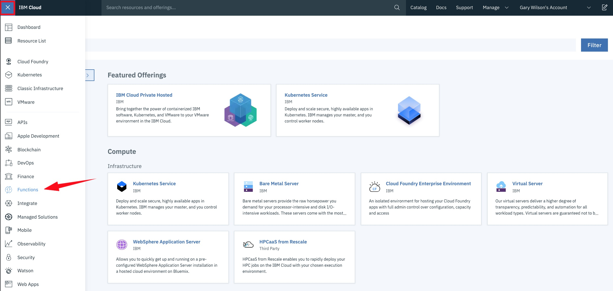

From there, first _**check the pulldown menu at the top right**_.

- If you are using your **own** IBM Cloud account, select the option from the menu that matches the location you have been using to create your existing services (you can check this [here](https://cloud.ibm.com/resources)).

- If you are using a **shared** IBM Cloud account, select the option that reflects the namespace and location you have been provided.

Next, click `Start Creating`, then `Create Action`.

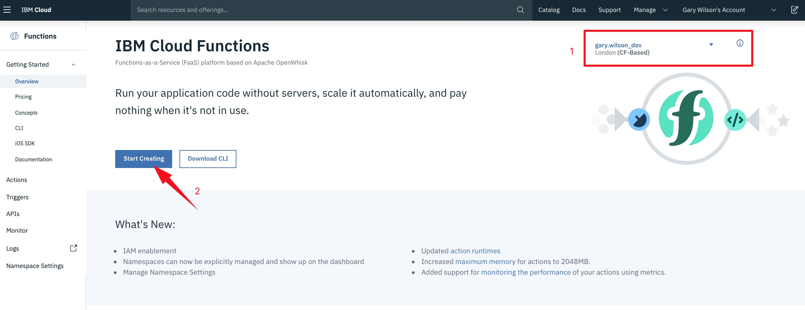

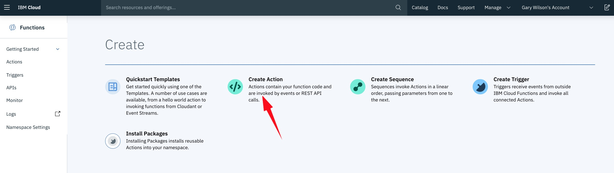

**(3)** Call your new action `RPA-XXX` - where XXX = your initials (so it has a unique name) - then ensure you select a `Runtime` of **Node.js 8**, and hit `Create`.

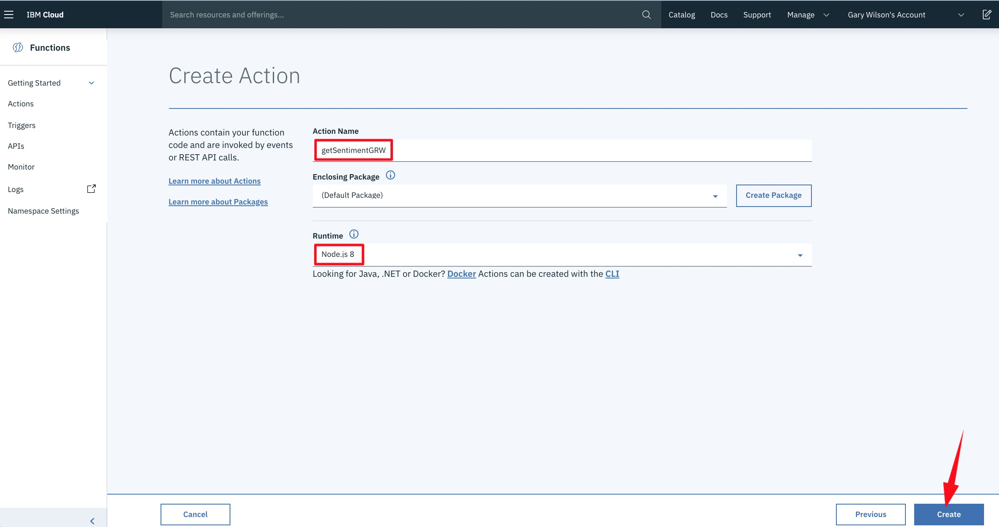

You'll then be transported to a code editor. Delete all of the default lines of code within the editor, and replace them with these:

```Javascript
/**
  *
  * main() will be run when you invoke this action
  *
  * @param Accepts a text string 'payload' used for the NLU query
  *
  * @return JSON object containing:
  *         score: sentiment score obtained from Watson NLU for payload
  *
  */
 
 MY CODE 
 
 
```
**(4)** You only need to make two small changes to this code.

- Replace `<endpoint>` with the value of your environment enpoint **enpoint**. 

_Make sure you remove the `<>` signs when you do the replacements!_

Now hit `Save`.

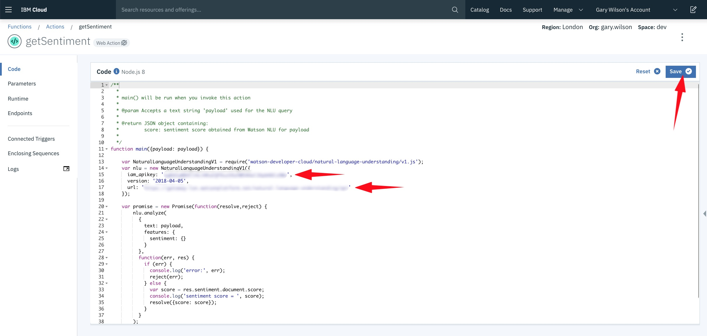

The code accepts text as input (_payload_), calls the _**RPA API**_ and returns the success value.

**(5)** We've now successfully created an _**IBM Cloud Function**_ that can accept text as input and talk to the RPA API. The final thing we need to do here is to make this function callable from within _**Watson Assistant**_ (or in fact, any other application).

Select `Endpoints` from the sidebar, tick the `Enable as Web Action` box, then `Save`.

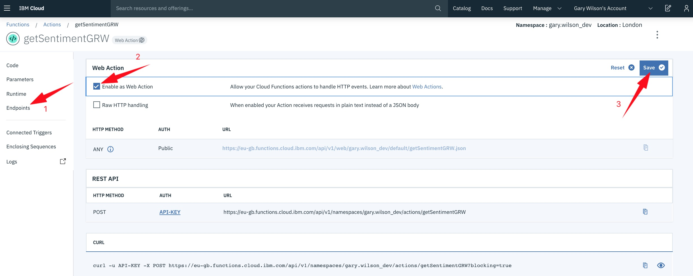

Now let's go and use our function in a new _**Watson Assistant**_ _intent_ and _dialog_.

## Create `Change Address` _intent_ and _dialog_
In order to show the _**Watson Assistant**_ service works perfectly in Finnish we will do the integration in Finnish. 
**(1)** Let's start with building an _intent_ called `#changeaddress` with some examples of text that a user might say to enter this dialog, e.g.
  - `Haluan vaihtaa firman osoite`
  - `EXAMPLE 2`
  - `EXAMPLE 3`
  - `EXAMPLE 4`
  - `EXAMPLE 5`
  - `EXAMPLE 6`

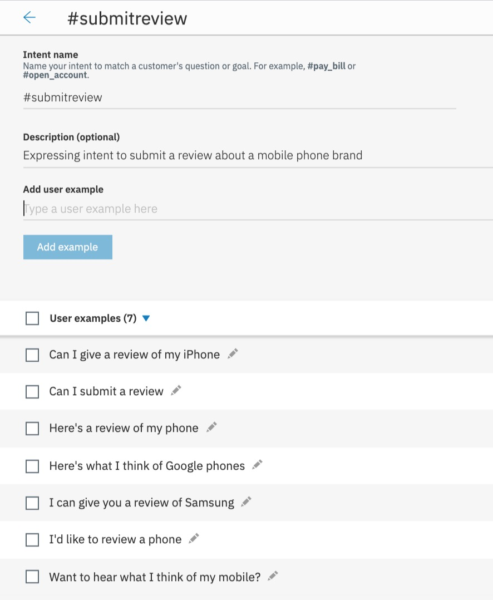

**(2)** Now let's create a `Change Address` _dialog_ node above our `Anything else` node, which tests for our `#changeaddress` _intent_.

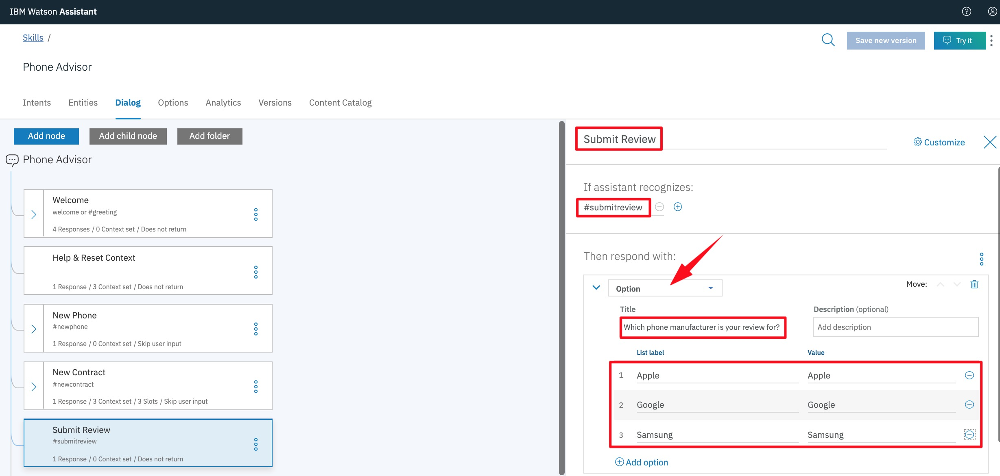


**(3)** Next, create a child node of `Change Address`.

Configure it as you see here:

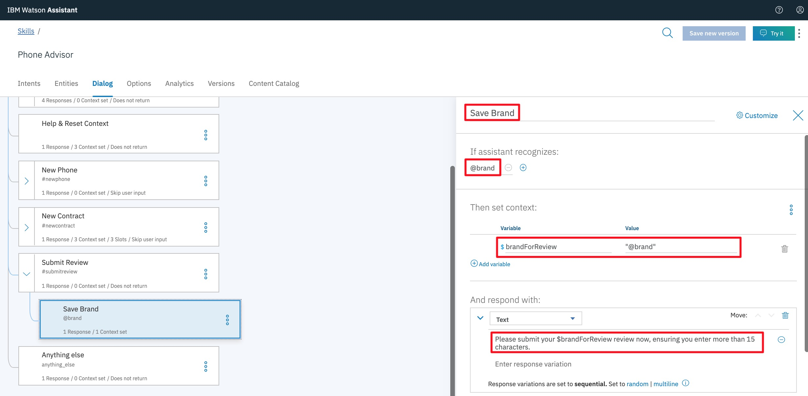

**(4)** The last thing the `Save Brand` node does is `Wait for user input`. This user input will be the review text that we want to send to our `getSentimentXXX` _**IBM Cloud Function**_.

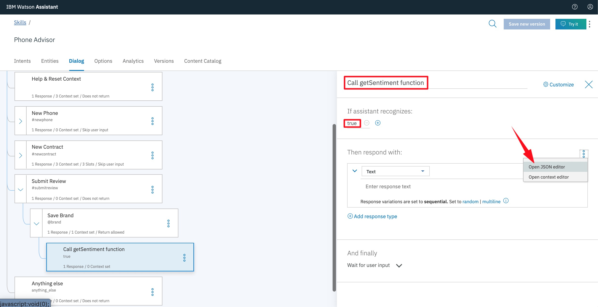

_**Watson Assistant's**_ _JSON editor_ provides an alternative method for defining responses. It's also the means by which we are able to call _**IBM Cloud Functions**_ from within a _dialog_.

**(5)** In the _JSON editor_, replace the existing code with this:
```Javascript
my action call 
```

The **only** thing you will need to replace here is `<my-getSentiment-endpoint>`. You can get the name of your _**endpoint**_ by going back to your _**IBM Cloud Function**_ in IBM Cloud, clicking `Endpoints` from the sidebar (if you're not already on that screen), then copying everything in the **Web Action URL** _after_ _**.../web/**_.

It should look something like:
```Javascript
name.lastname_dev/default/RPA-XXX.json
```

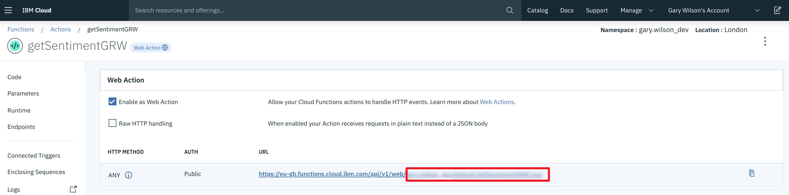

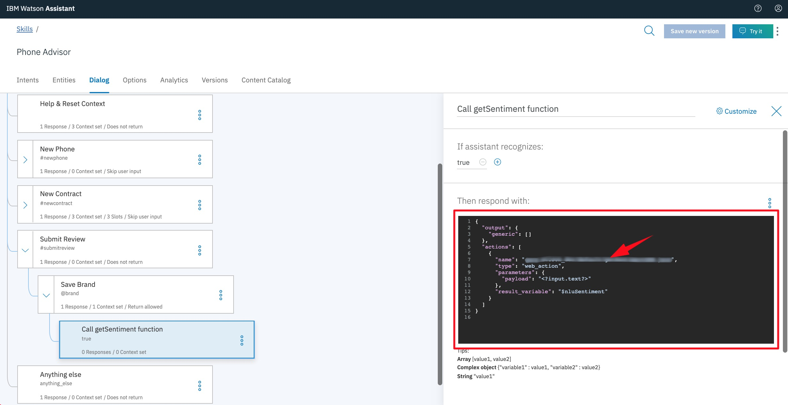

**(6)** When we reach this node in the _dialog_, we will now call our _**IBM Cloud Function,**_ passing `<?input.text?>` as our payload.

`<?input.text?>` is a special _**Watson Assistant**_ variable that always contains _the last input the user has provided_. In this case, this will be the review text we want to sent to our _**Watson NLU**_ sentiment analysis function.

You can see that we are also passing the _**IBM Cloud Function**_ credentials we set up earlier, and the data returned by the function will be stored in a _context variable_ we have called `$nluSentiment`.


THIS CAN BE ADDED TO THE SKILL - 
**(10)** The final thing we need to do to complete our `Submit Review` dialog branch is ensure all of our **And finally** parameters are correct, and that we **reset our context variables** when we finish.

Working backwards, in our `Send Feedback Message` node, ensure we jump to `Help & Reset Context`.

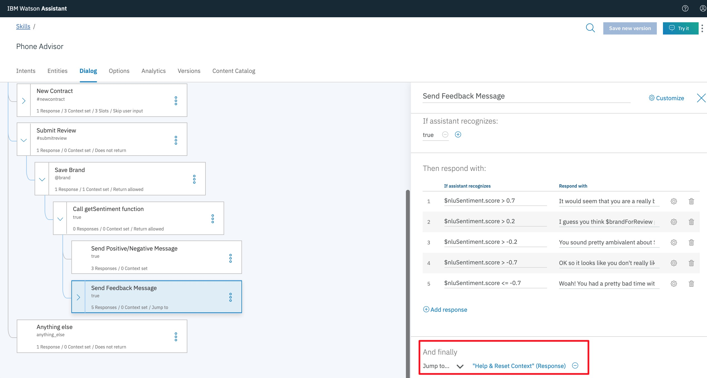

Then, configure the `Send Positive/Negative Message` node so it jumps to `Send Feedback Message`. This is to ensure that after we send the first message to the user, we immediately jump to the node that sends the second one.

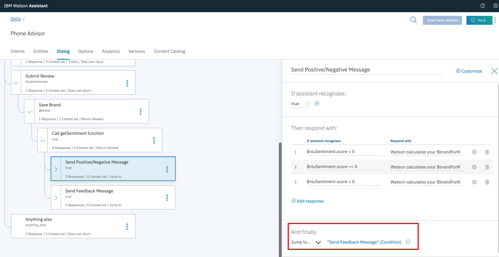

Next, change the `Call getSentiment function` node so that it will `Skip user input`, and immediately evaluate its two child nodes.

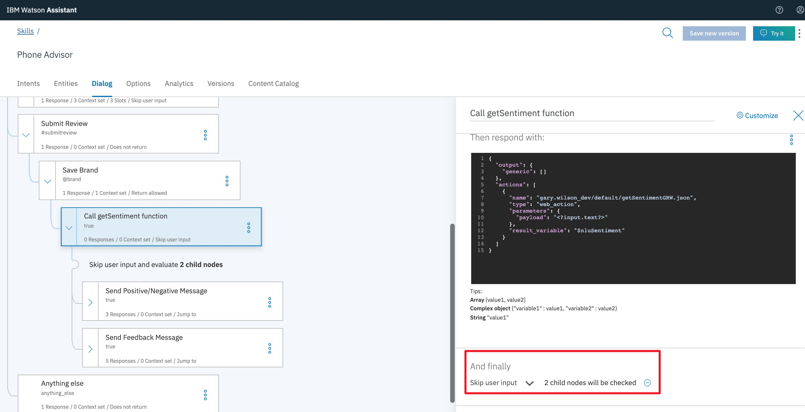

Finally, in our `Help & Reset Context` node, set the context variables `$brandForReview` and `$nluSentiment` to `null` so they are reset every time we complete a successful user interaction.

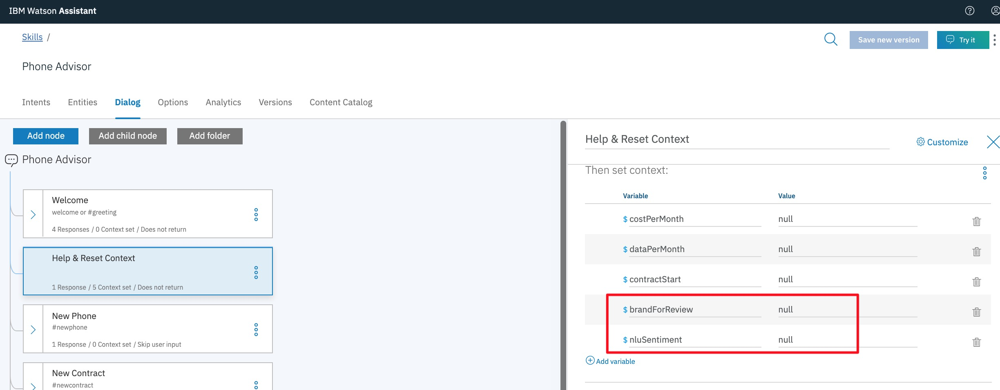

**(11)** Test your new dialog with `Try It`. When it works, try it out with one of your _integrations_. It should look something like this:

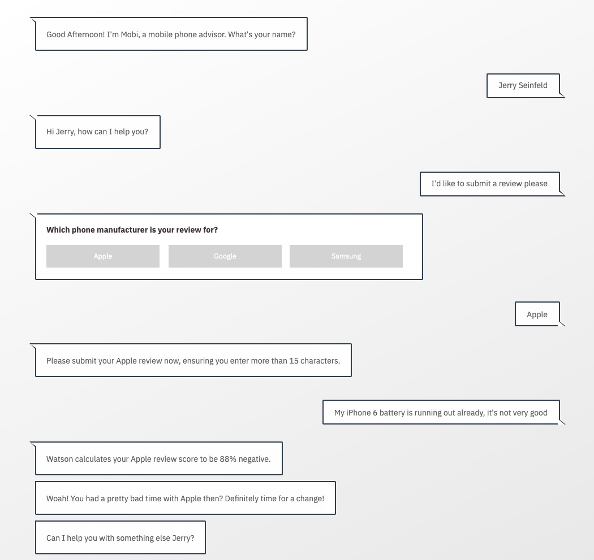
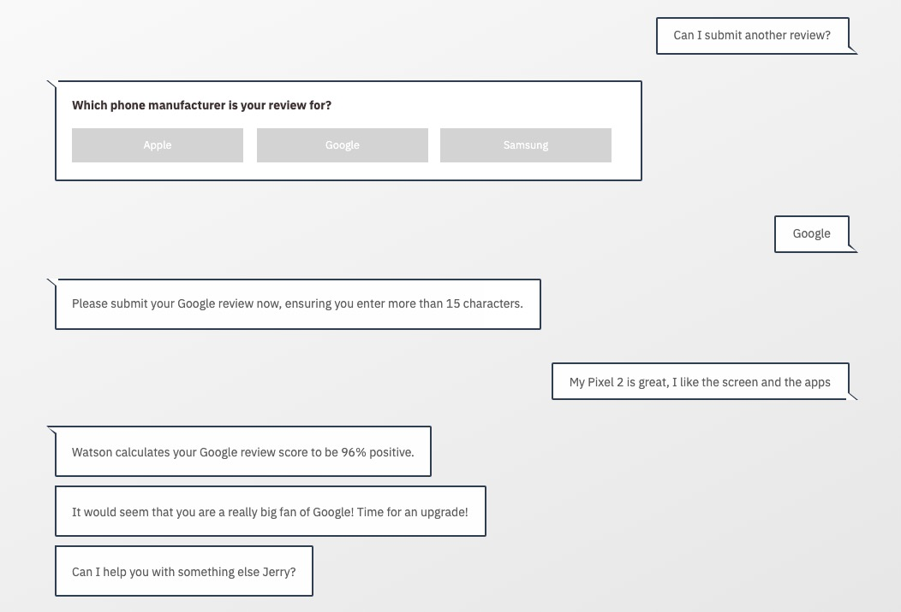

## Summary
You've reached the end of this lab! By completing it you've learned how to further enhance your chatbot by calling additional services using _**IBM Cloud Functions**_. 
