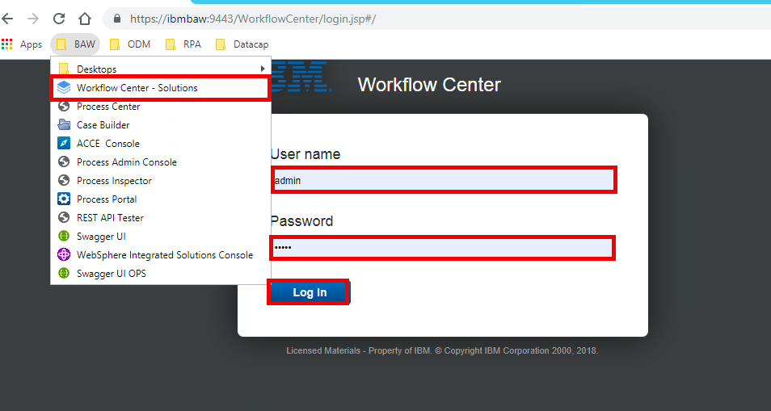
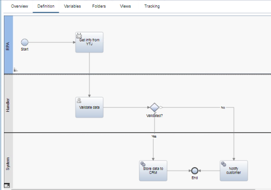
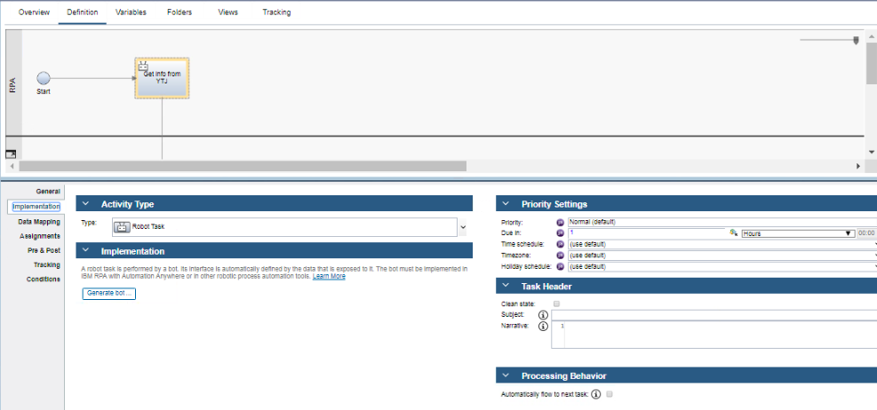

## Welcome to the BAW workshop
Here we will explore Business Automation Workflow (BAW) and view a few of its core functions. As BAW offers a wide variety of functions, we will focus only on the main elements used on this workshop. Every component used in this workshop is already done however it is important to understand on a high level what is happening. 

#### Content
- [Access to BAW](#access-baw)
- [Finding the workflow](#finding-the-workflow)
- [Quick guide on workflows](#quick-guide-on-workflows)
- [Editing workflows](#editing-workflows)  

#### Access BAW
Use the instructions given by your instructors to access your virtual environment and open it in your browser.

Within the virtual desktop, open Chrome and navigate to **BAW** Login (Bookmark folder BAW -> Workflow Center - Solutions). Fill in the ``username`` (admin) & ``password`` (admin) 

#### Finding the workflow  

After we have logged into Workflow Center, we want to select ``Process Apps``. From Process Apps, select and open the Process Application created for this workshop -> ``AWiB-workflow`` (click the blue "AW circle" within its tile). When the Process Application opens in web process designer, click ``AWiB-workflow`` from the left-hand side navigation bar and then from the opened menu ``Handle data change`` under ``Process``. This will open our workflow - the one that our Watson Assistant triggers - in designer.

#### Quick guide on workflows
This workflow has 3 lanes, **RPA**, **Handler** and **System** (these lanes are user defined so you can name them whatever you like)  
  
In this particular workflow:  
- **RPA** Is responsible of the robot actions.  
It takes values from the ``start`` node (values we sended from Watson assistant)  
and performs our ``Robot task`` that you will create.  
- **Handler** lane has an ``Validate data`` node.  
We have defined it to be a form. This form will show the information we got from the ``start`` node and the information from the ``Robot task`` node.  
The user has to review the information and decide if the information is valid.
- **System** lane has a few nodes in this setup.  
These nodes are completely demostrative for this workshop, but we have given a few examles you could do after the user has validated the data.  
If the data is valid, we could save the updated data to an CRM alternatively we could inform the customer that we couldn't update the information.   
#### Editing workflows
By clicking a node in the workflow, you are able to view and edit its functions.  
   
Settings we need to edit on the ``Robot task``:  
- **General** Give name and color. 
- **Implementation** Here you choose the type of the node, and if it is an ``Robot task``you will need to press **Generate bot...** to create an framework where you can later on implement the actions of the bot.  
- **Data Mapping** If the robot uses additional information we need to provide them to it. Here we map the data to parameters so that the bot is able to use it.

When you open an ``form node`` and you will have a new workflow where you define what the form does when you interact with it.
1. Open the ``form node``
2. From the ``Implementation``tab open the implementation file
3. Open the ``Diagram``tab and from the top-right corner press the run icon.
4. You now see what the user form looks like.
  
We have defined that it will send forward to the next node __true__ or __false__ depending on what the user has pressed.  

#### Summary
Well done! You've now explored a few of the basic elements of the Business Automation Workflow. Feel free to explore the diffrent nodes and options on this workflow.
