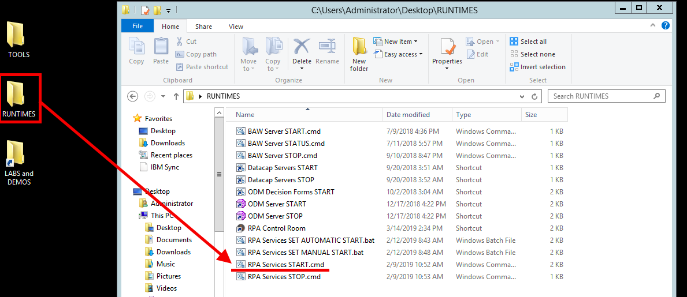

## Welcome to the RPA workshop
Here we will build the Robot that will fetch information from ytj.fi  

#### Content
- [Setup](#setup)
- [Launch RPA](#launch-rpa)
- [Robot Framework location](#robot-framework-location)
- [Editing the robot](#editing-the-robot)  
##### Setup
**Launch** RPA services, it will take a while to run the script.  
  

**Check** that the RPA is running by opening browser and check ``RPA Control room`` You should see this page.  
  

##### Launch RPA
 
After that login  with ``username``& ``password``
 
It might prompt you with a pop-up if so select __Automate__  

#### Robot Framework location
We have already created an skeleton framework for you to start.  

#### Editing the robot
You have diffrent options on the left where you can select actions for the robot.   
To start off you may want to use ``Open Browser`` & ``Object clone``  
With ``Object clone`` you are able to select element from a website and interact with them (set text, click, get location).  

``Hint`` you can add variables to field by pressing F2.  

If you get stuck or don't manage to get your bot to work, there is an ready bot in ``Completed``sub-folder.