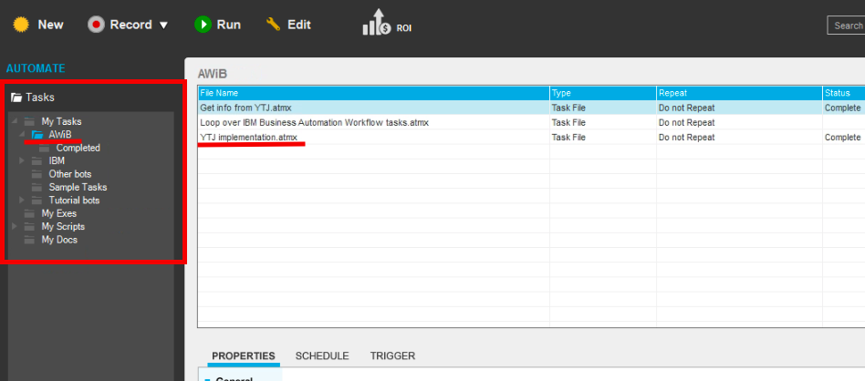

## Welcome to the RPA workshop
If the other sections where mainly reading and viewing already done elements, now you will get to create your own working bot with _Robotic Process Automation_ platform (IBM RPA with Automation Anywhere).  

What this ``bot`` should do:
1. Waits for a task assigment (Get info from YTJ) from the workflow (Handle data change) that is triggered from our _Cloud Functions_ within our Watson Assistant chatbot.
2. Receives the business_id (y-tunnus) from the workflow.
3. Navigates to _ytj.fi_ web site and creates a search with the given business_id.
4. Gathers the address information from the search result.
5. Sends the gathered information back to our workflow that automatically forwards it to the next task in the workflow (User validation).

#### Content
- [Setup](#setup)
- [Launch RPA](#launch-rpa)
- [Robot Framework location](#robot-framework-location)
- [Editing the robot](#editing-the-robot) 
- [Coding the bot](#coding-the-bot) 
- [Help](#help)

#### Setup
**Check** that the RPA is running by opening __Chrome__ web browser and opening ``RPA Control room`` from the bookmarks under RPA-folder. You should see this page (No need to login, just check that the page loads). If not, ask your instructor to help you.

  

#### Launch RPA
Open the __TOOLS__ folder from your desktop and double click __AA Enterprice Client 11.3__ to open our RPA editor.

After that login  with ``username`` (__developer__) & ``password`` (__adminadmin__).

   

It might prompt you with a pop-up - if so, select __Skip__ from the bottom-right. 

#### Robot Framework location
We have already created an skeleton framework for you to start.  

**!!** **If you double-click a file it will run it.**  **!!**  
You can edit the file by clicking it once and select edit from the top or right-click and select edit.  

Files in this directory:  
**Get info from YTJ**   
This is the main function. When we get an task from BAW, this file will run.  

**Loop over IBM Business Automation Workflow tasks**  
This function loops RPA tasks and if it finds tasks to the RPA, it will call ``Get info from YTJ``  

**YTJ implementation** . 
This is the file that has the robots actions. It will tell the robot what to do. ``Get info from YTJ`` calls this file.  

#### Editing the robot
Open the _YTJ implementation_ on edit mode.  

On the left you will see a list of functions you can use.  
We will need ``Open Browser``& ``Object clone``. Feel free to check other functions as well.  
You can delete a function by right-click -> Delete.  

On the right you will see a few bars, we are intrested on ``Variable Manager``.   

Here we have defined a few variables you will need:  

``business_id`` Here we have the business_id that we got from the chatbot.  
``street_address`` Here we will save the info we get from ytj.fi    
``postcode`` Here we will save the info we get from ytj.fi  
``city`` Here we will save the info we get from ytj.fi  
``street_address`` Here we will save the info we get from ytj.fi  
``info_row``This is used for our helper function. You will need to assingn the row where the the ``street_address postcode & city`` are located on the website. (Postiosoite)
   
##### Coding the bot
__1.__ To start off, open Internet Exlorer and navigate to ytj.fi  

__2.__ Next lets add a ``Object cloning`` and select the search box from the ytj.fi website. We will add the business_id value to it.

__3.__ We will want to next press the search button.  
  

__4.__ Now go and press the search button manually. We need to get to the next page for the next task.

__5.__ The robot needs to click the first search result.  
  

__6.__ Now go and press the first seacrh result manually. We need to get to the next page for the next steps.

__7.__ We Want to get the name of the company

Please check you have the values like so:  

  
   

__8.__ We need to select the position of postiosoite  
  

Please check you have the values like so:  
  
  
  

__9.__ Setup our function that gets dynamically our ``street_address``, ``postcode`` & ``city``  

##### Help
I can't select ytj.fi to my ``Object clone``   
> Please check you have the webpage open on the background. As it will list only pages you have open.  

How to add variables to fields?  
> Select the field you want the variable and press F2 . 

Robot isn't doing nothing  
> Make sure you don't have multiple webpages open, it will only work on one page.  

Web page stays open after task is completed  
> Remeber to add a close webpage at the end of all code blocks  

I'm stuck, what to do.  
> Don't hesitate to ask help.   

> Also if you can't get the functions to work. There is an working version. Ask assistance to get it setup.  
